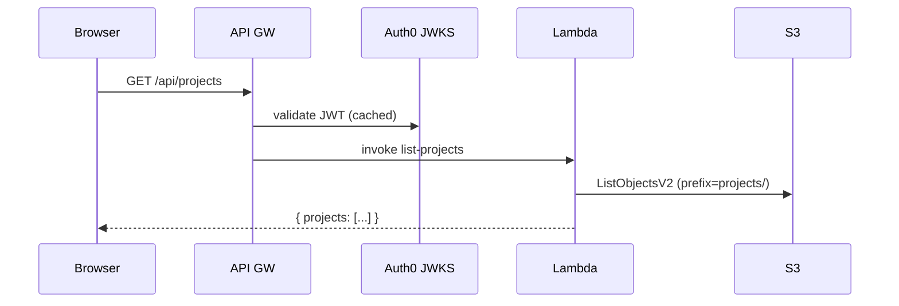
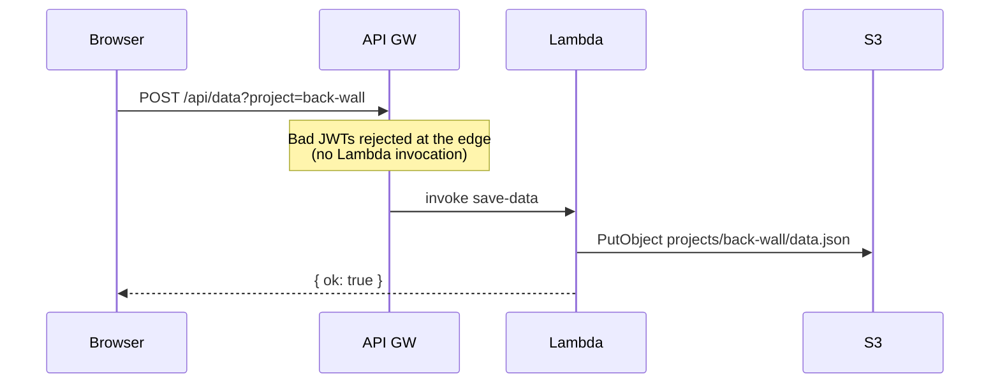
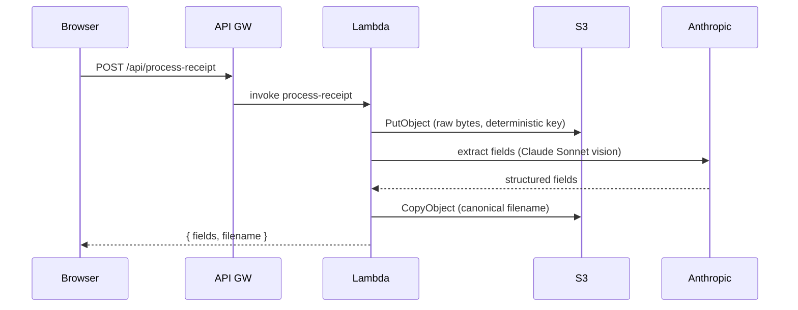
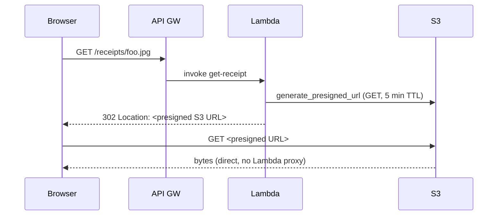

# AWS Lambda + S3 + API Gateway — design sketch

Captured 2026-05-10 from the conversation about whether to migrate the
backend from the current Pi K3s + Cloudflare Tunnel setup to AWS-managed
serverless. Not a decision yet — a design candidate to compare against
"keep it on a Pi" and the brainstormed contractor-view product expansion.

## Goal

Replace the Pi K3s backend (currently running on Joe's laptop, exposed via
`cloudflared` at `api.iproject.app`) with AWS-managed serverless components,
preserving the public contract:

- `https://iproject.app` (React SPA, GH Pages) → unchanged
- `https://api.iproject.app/api/*` → AWS API Gateway (instead of tunnel)

## Components

```
            iproject.app (GH Pages, React SPA)
                       │  Authorization: Bearer <jwt>
                       ▼
               api.iproject.app  (Cloudflare DNS only)
                       │
                       ▼
        ┌──────────────────────────────┐
        │  AWS API Gateway (HTTP API)  │
        │  ─ JWT authorizer ──► Auth0  │
        └──────────────┬───────────────┘
                       │  invoke
                       ▼
        ┌──────────────────────────────┐
        │  AWS Lambda (Python)         │
        │  ─ /api/projects             │
        │  ─ /api/data                 │
        │  ─ /api/process-receipt      │
        │  ─ /receipts/<file>          │
        │  ─ /api/fx-rate              │
        └──────────────┬───────────────┘
                       │
        ┌──────────────┴───────────────┐
        │                              │
        ▼                              ▼
 [Anthropic API]              [S3: iproject-prod]
   (Claude OCR)                projects/<slug>/data.json
                               projects/<slug>/receipts/*
```

## Request flows

### Read project list



### Save data (the hot path)



### Process receipt (multimodal)



### View receipt (presigned URL trick)



Why presigned: receipts can be megabytes. Streaming through Lambda burns
compute time and adds Lambda response-size limits. Browser fetches direct
from S3; Lambda just signs a short-lived URL.

## Storage layout

```
s3://iproject-prod/
└── projects/
    └── back-wall/
        ├── data.json
        └── receipts/
            ├── 2026-05-04_pix-500_francisco.jpeg
            ├── 2026-05-05_eiselle-662.jpeg
            └── …
```

No database. The `data.json` blob model from `server.py` carries over
verbatim — S3 `PutObject` replaces `save_data()`, S3 `GetObject` replaces
`load_data()`. Same shape the React app already speaks.

For multi-tenant (contractor view from the brainstorm), prefix with the
owner's Auth0 sub:

```
s3://iproject-prod/
└── users/
    └── auth0|abc123/
        └── projects/
            └── back-wall/
                ├── data.json
                └── receipts/
```

Or split by role. Decide at multi-tenancy time.

## Auth

- API Gateway HTTP API has a built-in **JWT authorizer**. Configure it with
  the Auth0 JWKS URL + audience (`https://api.iproject.app`) + issuer
  (`https://dev-ngomqe3vh6l2mszt.us.auth0.com/`). Keys cached for an hour.
- Invalid tokens get rejected at the edge — no Lambda invocation, no charge.
- The React side and the Auth0 tenant don't change at all.

## Deployment

Three options, ranked:

1. **AWS CDK (TypeScript)** — define stack as code: API GW + Lambda + S3
   bucket + IAM roles + Cloudflare DNS record (via the Cloudflare CDK
   provider, optional). Deploy with `cdk deploy`. Lives in `iproject/infra/`.
   Most flexible, infra-as-code.
2. **AWS SAM** — declarative YAML, simpler for pure Lambda+API GW apps but
   less flexible.
3. **Serverless Framework** — third-party, works fine but adds a dep.

CDK is the recommendation. Mention infra/ would import `pyiproject_core`
(or wherever the domain logic lives) as a Lambda layer or zipped dep.

## Local dev

Keep `server.py` as the fast dev loop. Lambda handlers become a thin
adapter that calls the same domain functions:

```python
# domain.py — pure logic, no HTTP, no storage backend assumed
def process_receipt(slug, blob, original, *, store, ai, contacts): ...
def list_projects(store): ...
def load_data(slug, store): ...

# server.py — local dev driver, filesystem store
class Handler(BaseHTTPRequestHandler):
    def do_POST(self): ...

# lambda_handlers.py — production driver, S3 store
def process_receipt_handler(event, context): ...
```

Two drivers, one core. Hexagonal: store and AI clients are injected.
SAM CLI also works (`sam local start-api`) but adds startup latency vs
plain `python server.py`.

## Cost estimate (family-scale)

Assumptions: you + your wife + a contractor or two; roughly 50–100 API
calls/day; ~100 MB of receipts in S3; Claude OCR runs a few dozen times a
month.

### Service-by-service

| Service | Free tier | Estimated use | Year 1 | Year 2+ |
|---|---|---|---|---|
| **Lambda** | 1M req + 400k GB-s/month **always free** | ~3k req, ~150 GB-s | $0 | $0 |
| **API Gateway HTTP API** | 1M req for first 12 months | ~3k req | $0 | ~$0.003 |
| **S3 storage** | 5 GB for first 12 months, then paid | ~100 MB | $0 | ~$0.002 |
| **S3 PUT/GET requests** | 2k PUT + 20k GET for first 12 months | ~100 PUT, ~3k GET | $0 | <$0.01 |
| **Data transfer out** | 100 GB/month for first 12 months | ~100 MB (receipt views) | $0 | ~$0.01 |
| **CloudWatch Logs** | 5 GB ingest + 5 GB storage **always free** | ~3 MB | $0 | $0 |
| **SSM Parameter Store** (SecureString for Anthropic key) | **always free** for standard params | 1 param | $0 | $0 |
| **ACM** (TLS cert for `api.iproject.app`) | **always free** when bound to AWS services | 1 cert | $0 | $0 |
| **DNS** (you keep Cloudflare) | n/a | n/a | $0 | $0 |
| **Anthropic API** (existing) | n/a | unchanged | — | — |

**Total AWS: ~$0/month year 1, ~$0.05/month year 2+.**

### What to skip to keep it free

- **Use SSM Parameter Store, not Secrets Manager.** Secrets Manager is
  $0.40/secret/month always. SSM standard SecureString params are free up
  to 10,000.
- **Don't add CloudFront in front of API Gateway.** Responses are
  personalized — no caching benefit. CloudFront is already implicit for
  the React app via GitHub Pages.
- **Don't use DynamoDB unless you actually need it.** S3-as-blob handles
  the `data.json` model just fine. DynamoDB's free tier (25 GB + 25 RCU +
  25 WCU) is generous but it's a different mental model and a migration
  cost.

### What might push you over the line

- **Receipt size.** 4k phone photos are 4–6 MB each. 1,000 receipts ×
  5 MB ≈ 5 GB → still in free tier year 1, then ~$0.12/month for storage
  alone. Compress receipts before upload in the `process-receipt` Lambda
  (downscale to long-edge 2000 px, JPEG q=80) to keep them around 500 KB.
- **The contractor view from the brainstorm doc.** 10–20 contractors ×
  10 projects × 50 receipts × 1 MB ≈ 5–10 GB plus more API traffic.
  Probably $2–5/month after year 1.
- **Lambda cold starts.** First call after ~15 min idle is 200–800 ms.
  For sub-200 ms always, **Provisioned Concurrency** is ~$3.50/month per
  warm instance. Not worth it for personal use; revisit if multi-tenant
  ever feels slow.

### Worst-case scenarios

- **You + wife + a couple contractors, light use**: $0/month
  indefinitely.
- **Contractor view live, 10 active projects with bids and progress
  photos**: $2–5/month.
- **Public-facing tool, hundreds of users**: $20–50/month — but at that
  scale the cost structure changes (CDN, possibly RDS instead of
  S3-as-blob, request-batching).

### Cost guardrails worth setting on day one

These are all free, and they're cheap insurance:

- **AWS Budgets alert at $5/month** — email if anything goes weird.
- **CloudWatch alarm on Lambda 5xx > 5% over 5 min** — catches a runaway
  before the bill does.
- **Lambda reserved concurrency limit** (e.g. 10) — caps blast radius of
  a misbehaving client or infinite loop.
- **S3 lifecycle rule**: noncurrent object versions expire after 30 days
  (versioning protects against accidents; lifecycle keeps storage costs
  bounded).

Practically: budget $1/month forever and it covers you with headroom for
the foreseeable life of the family-scale app.

## Security considerations

- **IAM**: Lambda execution role grants only `s3:GetObject`, `s3:PutObject`,
  `s3:ListBucket` on the specific bucket prefix. No wildcard access.
- **S3 bucket**: `BlockPublicAccess: true`, default SSE-S3 encryption,
  versioning enabled (cheap protection against accidental overwrite/delete).
- **API GW**: HTTPS only (TLS 1.2+). JWT authorizer rejects bad tokens at
  edge before Lambda invokes.
- **Secrets**: Anthropic API key in **AWS Secrets Manager** (or SSM
  Parameter Store SecureString). Lambda reads at cold start, caches in
  memory. Never in env vars committed to repo.
- **CORS**: API GW configured for `Access-Control-Allow-Origin:
  https://iproject.app` (and `http://localhost:5173` for dev). Same as
  current `server.py`.
- **Presigned URLs**: 5-minute TTL on receipt GETs. Short enough that a
  leaked URL has limited blast radius.
- **Logging**: CloudWatch retention 30 days. PII (payee names) appears in
  logs only if explicitly logged — keep them out of `INFO`-level prints.
- **Rate limiting**: API Gateway has burst + steady-state quotas; configure
  per-route to prevent runaway costs from a misbehaving client.

## Trade-offs vs Pi K3s (the path PLAN.md originally outlined)

| | AWS | Pi K3s |
|---|---|---|
| Up-front work | meaningful rewrite (~2–3 days) | almost zero (running today) |
| Ongoing ops | none (managed) | low (Pi 24/7, occasional updates) |
| Resilience | regional + redundant | depends on home power/network |
| Vendor lock-in | yes (AWS) | minimal (Cloudflare for DNS only) |
| Multi-tenant readiness | excellent | manageable, more careful |
| Cost | ~$0/mo | ~$0/mo (electricity ~$2/yr) |
| Latency from Brazil | 50–80ms (us-east-1) | depends on home upstream |
| Cold start | 200–800ms first call after idle | none |

## When to choose AWS

- The contractor-view product (multi-tenant, uptime matters, can't depend
  on home internet) is on the near-term roadmap.
- You want to stop thinking about the laptop/Pi at all.

## When to stay on Pi K3s

- Personal-only use stays the steady state.
- You'd rather invest the 2–3 days into product features than infra.

## Out of scope here

- CloudFront in front of API GW (only useful if we cache, which we don't).
- DynamoDB instead of S3-as-blob (more capable but more migration; S3 is fine
  for the current data shape).
- A second region or multi-AZ posture (overkill for personal use).

## Decision log

This document captures a candidate, not a chosen path. Decision pending
against:

1. Pi K3s as `docs/PLAN.md` originally outlined (no rewrite).
2. Cloudflare Workers + R2 (similar serverless model, stays on Cloudflare,
   would require porting `server.py` to TS).
3. This AWS sketch.
